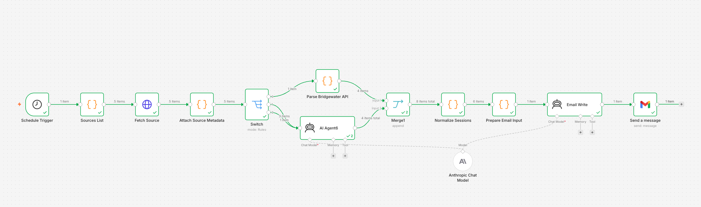

# AI Skating Schedule Assistant

A multi-source AI agent built with n8n + Claude that automatically collects figure skating schedules from webpages, images, and APIs, normalizes the data into structured JSON, and sends a daily skating digest email.

# Workflow Overview



---

## Features

- Multi-source ingestion
- HTML scraping
- OCR/image schedule extraction
- Daysmart API parsing
- Unified session normalization
- Daily email digest
- Freestyle/public session detection

---

## Architecture

```text
Sources List
↓
Fetch Source
↓
Attach Metadata
↓
Switch
├── API Parser
└── AI Extractor
↓
Normalize Sessions
↓
Prepare Email Input
↓
Email Writer
↓
Gmail
