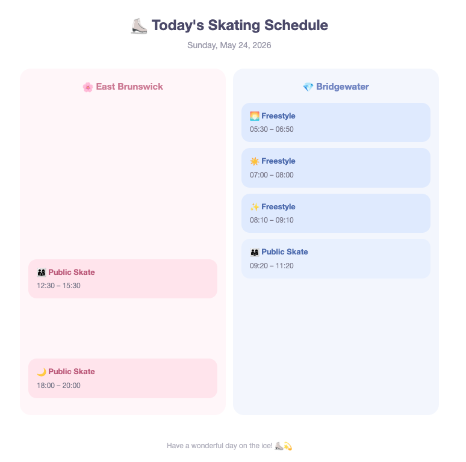

# AI Skating Schedule Assistant

An AI-powered skating schedule assistant that collects skating sessions and sends a daily skating digest email. Built with n8n + Claude. 

# Architecture

# Features

- Multi-source ingestion from webpages, images, and APIs
- OCR/image extraction
- API parsing
- Unified JSON normalization
- Automated daily digest emails
- AI-powered schedule extraction

